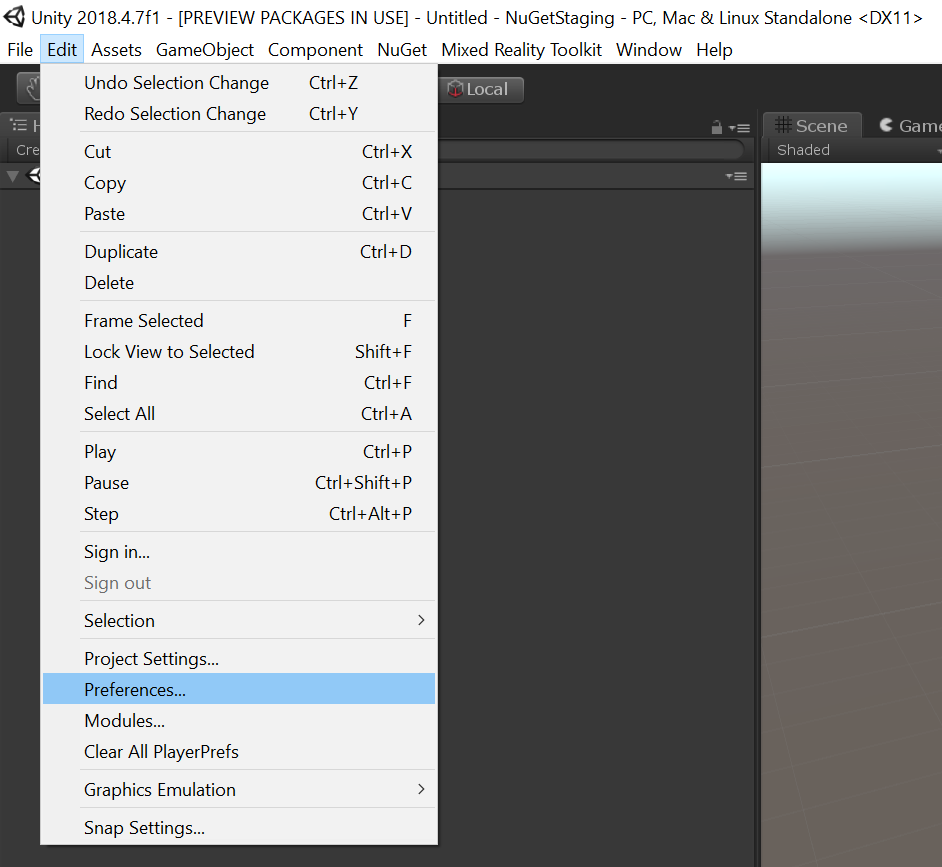
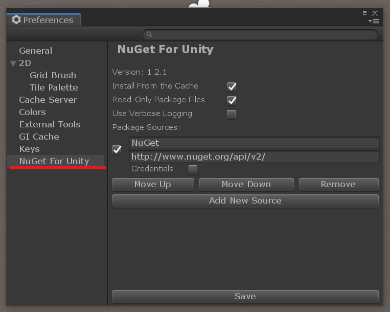

# Mixed Reality Toolkit NuGet Package

Mixed Reality Toolkit (MRTK) is now available as a NuGet package on NuGet.org. There are some differences when it comes to consuming NuGet version of MRTK as opposed to a .unitypackage, read **NuGet Package Considerations** below. If any issues are encountered, file an issue using this [template](https://github.com/microsoft/MixedRealityToolkit-Unity/issues/new?assignees=&labels=Bug,Package%20Management%20-%20NuGet&template=bug-report.md&title=).

## Installing the NuGet Package

Follow these instructions to add the Mixed Reality Toolkit as a NuGet package to your project.

1. Download the latest [NuGetForUnity](https://github.com/GlitchEnzo/NuGetForUnity/releases/latest) .unitypackage
1. Import the package into your Unity project, [instructions](https://docs.unity3d.com/Manual/AssetPackages.html).
1. In the Unity menu bar, click on **NuGet > Manage NuGet Packages**.

    
1. In the Search box, enter `Microsoft.MixedReality.Toolkit`.

    
1. Choose the MRTK core package:
    - **Microsoft.MixedReality.Toolkit.Foundation** – The core package for MRTK.
1. (Optional) Choose the MRTK optional packages.
    - **Microsoft.MixedReality.Toolkit.Examples** – The package that contains all of our examples.
    - **Microsoft.MixedReality.Toolkit.Extensions** – The package that contains extensions services and/or data providers.
    - **Microsoft.MixedReality.Toolkit.Tools** – Contains some of the tooling that comes with MRTK (Build Window, etc).

### Updating MRTK NuGet Packages

Steps 1-2 above will only need to be done once for your project, and the update is a much simpler step. Once newer packages available on NuGet.org (including prerelease), follow these steps:

1. In the Unity menu bar, click on NuGet > Manage NuGet Packages.
1. Switch to the **Updates** tab.
    - Check the **Show prerelease** box if you want to get latest prerelease version.
1. Update the packages desired.

## NuGet Package Considerations

The release of MRTK as NuGet package is a new delivery mechanism being explored and there are a couple of key benefits and considerations one must make when choosing whether to consume the NuGet version of MRTK.

### Migrating to NuGet from .unitypackage or Source (Not Yet Supported)

NuGet package consists of compiled binaries as opposed to loose script files, and the C# script asset identifiers are different. As such, the assets like prefabs in the MRTK package have been updated to reference the appropriate compiled script. A project using the .unitypackage or source version of MRTK will have to re-target it's assets as well, and although there is code for it this is not a supported scenario, yet.

*Thereby, there is no currently supported way of migrating to NuGet from .unitypackage or source. This will change as we continue development on this delivery mechanism.*

### Compiled Binaries (NuGet) vs Source Files (.unitypackage)

Since the NuGet package contains the compiled binaries instead of scripts, this has two major advantages:

- Reduced compilation time
- Considerably C# Project files in Visual Studio

### Debugging Mixed Reality Toolkit

There are known issues with Unity & Visual Studio Tools for Unity that prevent a PDB from being easily debugged in Visual Studio Debugger. So although the package comes with PDBs and source embedded, debugging the DLLs is possible only if it was locally built (read further). There is a workaround being built as part of [MSBuildForUnity](https://github.com/microsoft/MSBuildForUnity/), more updates on that later.

## Locally Building the NuGet Package

With the latest source from MRTK, you can build the NuGet package locally and configure NuGetForUnity to pick it up.

1. Download the latest MRTK source.
1. Execute the `scripts\packaging\createnugetpackages.ps1` powershell script.
    - Specify the `-UnityDirectory` flag by passing the Editor folder of your Unity installation
    - Specify the `-Version` of the package to create, in x.x.x format. **Make sure the version is higher than available on NuGet.org**
    - **Example:** `.\createnugetpackages.ps1 -UnityDirectory "C:\Program Files\Unity\Hub\Editor\2018.3\Editor" -Version 2.0.2`
1. After the build succeeds, open the destination project with NuGet packages.
    - Click on the menu **Edit > Preferences...**

        
    - On the left, find **NuGet for Unity** tab.

        
    - Press **Add New Source** and replace **source_path** with the `<Path to your Repository>\NuGet\artifacts`

        
1. If this your first time building, or the version was incremented, follow the update process:
    1. In the Unity menu bar, click on **NuGet > Manage NuGet Packages**.

        
    1. Switch to the **Updates** tab.

        
    1. Update the packages to the version you just built desired.
1. Otherwise, just delete the `Assets\Packages` folder and let NuGetForUnity restore the packages.
